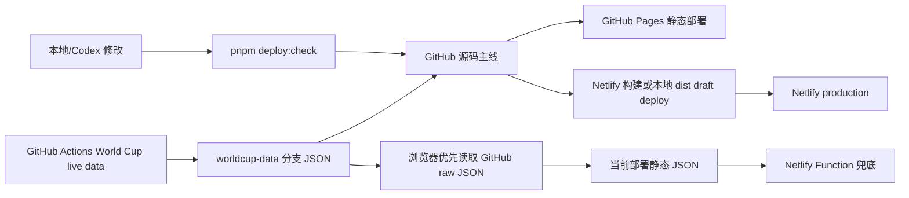

# Starsail 网站架构与技术路线调研报告

调研日期：2026-07-09  
项目路径：`/Users/jinchen/Documents/Codex/2026-06-27/da/outputs/starsail-netlify-site-github`

## 1. 结论摘要

Starsail 当前的技术路线是合理的：以 Astro 静态站为主体，以 GitHub 作为源码主线，以 Netlify 和 GitHub Pages 作为双公网出口，再用 GitHub Actions、静态 JSON、少量 Netlify Functions 承载动态数据兜底。这条路线非常适合当前项目的真实需求：个人门户、视觉实验、少量专题页、低成本上线、可由 Codex 持续维护。

不建议现在整体迁移到 Next.js、Docusaurus、VitePress 或复杂后端。大厂官网和知名开发者文档站点的共同趋势不是“所有站都用同一个框架”，而是“内容型页面尽量静态化，动态能力边缘化或 API 化，发布流程预览化，数据和页面构建分层”。当前项目已经走在这条线上。

最需要治理的不是底层选型，而是增长后的工程边界：

- `src/scripts/worldcup-dashboard.js` 和 `src/styles/worldcup.css` 已经成为最大的单体模块，应继续拆分。
- 当前测试集中在世界杯纯函数逻辑，缺少端到端页面冒烟、视觉回归、可访问性和性能预算。
- 世界杯与 maimai 的数据量已经超过普通个人站，应逐步做懒加载、分片和缓存策略。
- 发布流程文档清楚，但仍建议把“两端公网一致性验证”进一步脚本化，减少人工漏项。

推荐路线：保留 Astro 静态优先架构；短期补模块化和测试，中期引入内容集合/MDX 或更细的数据 API，长期只有在出现登录、复杂后台、多人内容编辑、频繁个性化时再评估 SSR/full-stack 框架。

## 2. 本项目当前架构

### 2.1 技术栈

本项目当前使用：

- Astro `^7.0.3`，静态构建输出。
- Node.js `24.14.0`，pnpm `11.7.0`。
- 普通 Astro 组件、HTML、CSS、浏览器端 JavaScript。
- TypeScript 主要用于 `src/lib/maimai`、CLI 和 Netlify Functions。
- Netlify Functions 用作 maimai 和世界杯兜底接口。
- GitHub Actions 用作 GitHub Pages 部署和世界杯数据刷新。
- Supabase 是 maimai 历史数据的可选服务端能力，默认页面仍以静态快照为主。

核心配置很轻：

- `astro.config.mjs` 只配置 `site` 和 `base`，用于适配 Netlify 根路径与 GitHub Pages 子路径。
- `netlify.toml` 只声明 `pnpm build` 和 `dist`。
- `package.json` 的质量门槛是 `pnpm deploy:check`：测试、类型检查、文案集中检查、Astro 构建。

### 2.2 页面与功能边界

项目从单页门户扩展为多页面 Astro 站点：

- `/`：夜间默认个人入口。
- `/maimai/`：maimai 成绩静态快照页。
- `/worldcup/`：世界杯实时赛事展示页。
- `/worldcup/moments/`：关键瞬间独立页。
- `/lab/*`、`/intro-demo/`：设计和交互实验页。

页面入口普遍很薄，主要负责导入布局、组件、样式和脚本。实际交互主要在 `src/scripts/`，数据归一化和更新策略主要在 `src/lib/`、`src/worldcup/lib/`、`scripts/`、`netlify/functions/`。

### 2.3 内容与数据

静态文案集中在：

- `src/content/site-text.md`
- `src/content/siteText.ts`

动态或派生数据分层明显：

- maimai：`src/data/maimai/*` 存本地快照、历史、曲库和完整记录。
- 世界杯：`public/data/worldcup-live.json` 作为公网静态兜底；`worldcup-data` 分支作为实时 JSON 来源；`src/worldcup/data/*` 存球队、球员名映射和人工覆盖。

当前数据体量信号：

- `public/data/worldcup-live.json` 约 485 KB。
- `src/data/maimai` 下本地数据合计约 3.2 MB。
- 构建后的 `dist` 约 1.9 MB。
- 构建后最大的前端资源是世界杯 CSS 约 77 KB、世界杯 JS 约 69 KB、世界杯 JSON 约 485 KB，均为未压缩本地文件大小。

这些数字对个人站不危险，但已经足够提示：未来应避免把所有数据都变成首屏负担。

### 2.4 部署与运行

当前发布链路：



世界杯浏览器端读取顺序是：

1. GitHub `worldcup-data` 分支 raw JSON。
2. 当前部署内的静态 JSON。
3. Netlify Function。
4. 最新但过期的静态 payload，并显示过期提示。

这个设计的方向是对的：把实时数据生成从 Netlify 挪到 GitHub Actions，降低 Netlify 额度压力；GitHub Pages 虽不能跑 Functions，也能通过静态 JSON 工作。

### 2.5 已验证状态

本次调研运行了：

```bash
pnpm deploy:check
```

结果通过：

- Node test：9 个测试通过。
- TypeScript：`tsc --noEmit` 通过。
- 文案集中检查：通过。
- Astro build：生成 7 个页面。

调研开始时已有未提交改动：

- `README.md`
- `src/scripts/worldcup-dashboard.js`
- `src/styles/worldcup.css`

本报告不回退这些改动，只基于当前工作区状态评估。

## 3. 外部技术路线调研

### 3.1 可官方验证的案例

| 站点/项目 | 可验证技术路线 | 对 Starsail 的启发 |
| --- | --- | --- |
| Astro 官方 | Astro 强调 Islands、UI-agnostic、Server-first、Zero JS by default、Content collections，定位为内容型网站框架。[Astro Docs](https://docs.astro.build/en/concepts/why-astro/) | Starsail 当前选型与内容型、个人站、轻交互场景高度吻合。 |
| Cloudflare Developer Docs | 开源仓库 `cloudflare/cloudflare-docs`，包名 `cloudflare-docs-starlight`，使用 Astro、Starlight、MDX、React、Tailwind、Vitest、Wrangler。[仓库](https://github.com/cloudflare/cloudflare-docs)、[package.json](https://raw.githubusercontent.com/cloudflare/cloudflare-docs/production/package.json) | 大型开发者文档也会选择 Astro/Starlight，说明 Astro 不只是小站玩具。 |
| GitHub Docs | 开源仓库 `github/docs`，当前依赖 Next.js、React、Express、TypeScript、Vitest。[仓库](https://github.com/github/docs)、[package.json](https://raw.githubusercontent.com/github/docs/main/package.json) | 大型文档站在内容、版本、权限、搜索、产品矩阵复杂时，会选择 Next/React + 服务端能力。 |
| React.dev | 开源仓库 `reactjs/react.dev`，使用 Next.js、React、Tailwind、TypeScript。[仓库](https://github.com/reactjs/react.dev)、[package.json](https://raw.githubusercontent.com/reactjs/react.dev/main/package.json) | React 官方站不是纯静态生成器路线，而是 Next 体系；适合高度定制的交互式文档。 |
| MDN Web Docs | MDN 旧前端 Yari 曾是 React app；MDN 官方博客说明旧 React/CRA/Webpack/Sass 组合积累技术债，并描述新前端从 Markdown/content 构建到 SSR、Web Components、CDN 分发的流水线。[MDN deep dive](https://developer.mozilla.org/en-US/blog/mdn-front-end-deep-dive/)、[Yari 仓库](https://github.com/mdn/yari) | 内容型站点过度客户端化会变成负担；Starsail 应继续控制前端 JS 体积和 CSS 耦合。 |
| GOV.UK | 官方说明 GOV.UK 核心是发布平台，许多内容可表示为静态 HTML；由 Ruby on Rails 微服务分成 publishing/rendering，并依靠 CDN 缓存承接大部分流量。[GOV.UK account architecture](https://insidegovuk.blog.gov.uk/2021/01/07/the-technical-architecture-behind-a-gov-uk-account/)、[GOV.UK architecture docs](https://docs.publishing.service.gov.uk/manual/architecture.html) | 大型公共服务也遵循“内容发布平台 + 缓存优先 + 动态能力分层”，和 Starsail 的静态 JSON/Functions 思路同向。 |
| Docusaurus | Meta 生态的 React 静态站生成器，官方说明它构建 SPA、使用 React/MDX、文档功能开箱即用；SSG 产物部署到 CDN，无服务端运行时。[Docusaurus intro](https://docusaurus.io/docs)、[SSG](https://docusaurus.io/docs/advanced/ssg) | 如果未来 Starsail 变成大型文档/手册，Docusaurus 是可选；但当前个人门户不需要它的整套文档系统。 |
| VitePress / Vue docs | VitePress 是 Vite + Vue 的 SSG，面向 Markdown 内容，Vue 官方文档也基于 VitePress。[VitePress](https://vitepress.dev/guide/what-is-vitepress) | 如果未来以 Markdown 文档为中心且偏 Vue 生态，VitePress 可选；当前 Astro 已覆盖需求。 |
| Microsoft Learn / DocFX | Microsoft Learn 节目页介绍 DocFX 是可从源码和 Markdown 生成文档的开源静态站生成器；DocFX 输出 `_site` 静态 HTML，可发布到 GitHub Pages。[Microsoft Learn](https://learn.microsoft.com/en-us/shows/on-dotnet/intro-to-docfx)、[DocFX](https://dotnet.github.io/docfx/) | 文档即代码、Markdown + 静态输出仍是大厂文档体系的主流路线之一。 |
| Ant Design | Ant Design 官方资源中列出 dumi 作为组件文档生成器，Ant Design 自身是 React/TypeScript 组件库。[Ant Design FAQ](https://ant-design.antgroup.com/docs/react/faq)、[Ant Design repo](https://github.com/ant-design/ant-design) | 组件库/设计系统官网更适合用 dumi、Docusaurus 等文档生成器；Starsail 还没到这个阶段。 |
| Netlify | 官方文档强调 build command、publish directory、Deploy Previews；Deploy Preview 可在生产发布前预览和协作。[Build config](https://docs.netlify.com/build/configure-builds/overview/)、[Deploy Previews](https://docs.netlify.com/deploy/deploy-types/deploy-previews/) | 当前“本地 dist draft deploy -> 验证 -> production”的做法符合预览优先思想。 |
| GitHub Pages | 官方支持从分支发布，也支持自定义 GitHub Actions 构建静态站；Actions 流程一般是 checkout、build、upload artifact、deploy pages。[GitHub Pages publishing source](https://docs.github.com/en/pages/getting-started-with-github-pages/configuring-a-publishing-source-for-your-github-pages-site) | Starsail 用 GitHub Actions 构建 Astro 并设置 `BASE_PATH` 是正确方向。 |

### 3.2 黑盒观察，置信度较低

对未公开源码的企业官网，只能通过 HTTP 响应头和 HTML 信号粗略观察，不能当作架构事实。

本次 2026-07-09 抓取到的信号：

- `react.dev`：页面含 `__NEXT_DATA__` 和 `/_next/`，响应经 Vercel；公开仓库也验证 Next.js。
- `docs.github.com`：响应头含 `x-powered-by: Next.js`，页面含 `__NEXT_DATA__` 和 `/_next/`；公开仓库也验证 Next.js。
- `developers.cloudflare.com`：页面含 `/_astro/` 和 `astro-island`；公开仓库验证 Astro/Starlight。
- `www.cloudflare.com`、`www.netlify.com`：页面含 Astro island 信号，但需视为黑盒观察。
- `vercel.com`：响应头含 `x-powered-by: Next.js, Payload`，页面含 `/_next/`。
- `apple.com`、`microsoft.com`：响应主要体现自研服务、缓存和 CDN，未暴露稳定框架信号；对个人站选型参考价值有限。

### 3.3 大厂路线的共同点

综合上面案例，真正值得借鉴的是这些原则：

1. 内容型页面优先静态化。
2. 首屏尽量交付 HTML/CSS，少发不必要 JS。
3. 动态数据通过 API、静态 JSON、边缘函数或独立数据服务分层。
4. 内容和代码放进 Git 工作流，用 CI 做构建和检查。
5. 发布前有 preview/draft/staging URL。
6. 大站依靠 CDN 缓存吸收流量，而不是把每个请求都打到应用服务。
7. 复杂度来自组织、内容规模、权限和个性化，不来自“官网”这个名词本身。

## 4. 与当前项目的匹配度评估

### 4.1 选型匹配度：高

Starsail 当前更像“个人门户 + 内容型专题页 + 数据可视化实验”，而不是电商、SaaS 控制台、登录社区或多角色后台。

Astro 的优势正好覆盖：

- 页面多数是内容和展示。
- 需要高审美、少量交互、轻量动效。
- 需要静态托管和低成本部署。
- 未来可以逐步引入 MDX、Content Collections、React/Svelte/Vue islands，而不是一次性变成大框架应用。

因此，当前不需要迁移到 Next.js。Next.js 的价值在 SSR、复杂数据获取、登录态、动态路由、服务端组件、全栈路由和大规模 React 团队协作。Starsail 目前用不到这些主能力，迁移会带来：

- 更多依赖和运行时复杂度。
- GitHub Pages 静态备用部署难度上升。
- Netlify/Vercel 平台耦合更强。
- Codex 小步改动的认知成本变高。

### 4.2 工作流匹配度：中高

当前工作流已经比较成熟：

- 文档先行：`README.md`、`PROJECT_BRIEF.md`、`ARCHITECTURE.md` 明确约束。
- 质量门槛集中：`pnpm deploy:check`。
- 发布有主线：GitHub 是源码主线，Netlify 是公网主站，GitHub Pages 是静态备用。
- 世界杯数据刷新从 Netlify 移到 GitHub Actions，成本意识明确。
- Canva/Figma 只作为设计探索和素材来源，不作为最终发布主线。

不足在于：

- 发布验证仍偏人工。文档写得很细，但应继续脚本化。
- 大改与小改边界可以更明确。小文案/样式可以直接改，大型功能应走分支、预览、检查清单。
- 当前没有强制 PR/Deploy Preview 流程。个人项目可以不强制，但影响公网的改动最好至少保留 draft URL。

### 4.3 架构风险：中

最大的工程风险集中在世界杯页面：

- `src/scripts/worldcup-dashboard.js` 约 4,288 行。
- `src/styles/worldcup.css` 约 4,637 行。
- 一个浏览器脚本承担数据抓取、tab 状态、滚轮交互、日期筛选、关键瞬间、淘汰赛绘制、进球动画、冠军层等多种职责。

这还没有成为生产事故，但已经超过“轻松维护”的边界。继续在同一个文件里追加功能，后续每次改动都更容易产生行为回归。

其次是测试边界：

- 当前有 2 个测试文件，覆盖进球检测和刷新策略。
- 缺少页面级冒烟测试，例如首页、maimai、worldcup 是否能在真实浏览器打开。
- 缺少视觉回归，尤其是当前项目强调气质、留白、夜间默认、动画和头像展示。
- 缺少无障碍检查和基础性能预算。

第三是数据边界：

- 世界杯 JSON 已接近 500 KB。
- maimai 数据在源码中持续增长。
- 如果未来加入更多专题页或历史记录，应该避免所有页面都承担数据体积。

## 5. 建议路线

### 5.1 保持的东西

继续保持：

- Astro 静态优先。
- GitHub 作为源码主线。
- Netlify + GitHub Pages 双公网入口。
- `site-text.md` 集中文案。
- `design/` 作为设计素材中转区。
- `pnpm deploy:check` 作为上线前主检查。
- 世界杯数据由 GitHub Actions 更新，Netlify Functions 只做兜底。
- maimai 页面默认静态快照，远端刷新显式开启。

这些都是和项目体量相称的选择。

### 5.2 短期，1-2 次工作

1. 继续拆分世界杯脚本。

建议从低风险边界开始：

- `src/scripts/worldcup/state.js`
- `src/scripts/worldcup/schedule-wheel.js`
- `src/scripts/worldcup/moments-renderer.js`
- `src/scripts/worldcup/bracket-renderer.js`
- `src/scripts/worldcup/formatters.js`

目标不是“模块越多越好”，而是让每个模块职责单一，纯函数可测试，DOM 副作用集中。

2. 拆分世界杯样式。

建议逐步形成：

- `src/styles/worldcup/base.css`
- `src/styles/worldcup/topbar.css`
- `src/styles/worldcup/schedule.css`
- `src/styles/worldcup/moments.css`
- `src/styles/worldcup/bracket.css`
- `src/styles/worldcup/overlays.css`

如果 Astro 入口仍只 import 一个 `worldcup.css`，可以先用 CSS `@import` 或构建阶段合并，不必一次改变页面入口。

3. 增加页面级冒烟测试。

建议引入 Playwright 或 Astro-friendly 的轻量浏览器测试，覆盖：

- `/`
- `/maimai/`
- `/worldcup/`
- `/worldcup/moments/`

检查项可以非常朴素：

- 页面能打开。
- 关键标题存在。
- 无明显控制台错误。
- 主题切换不报错。
- 世界杯数据错误时有 fallback UI。

4. 增加构建产物预算。

先不用复杂工具，脚本检查即可：

- 最大 JS 单文件不超过 120 KB 未压缩。
- 最大 CSS 单文件不超过 120 KB 未压缩。
- 首页 HTML 不超过约 80 KB。
- `worldcup-live.json` 超过 800 KB 时给出警告。

### 5.3 中期，3-6 次工作

1. 引入 Astro Content Collections 或 MDX。

当未来出现多篇文字、更新日志、作品记录、专题文章时，再把内容从 `site-text.md` 分化为内容集合：

- `src/content/posts/`
- `src/content/logs/`
- `src/content/projects/`

当前无需提前引入。

2. 世界杯数据进一步分片。

可以把首屏需要和详情需要拆开：

- `worldcup-summary.json`
- `worldcup-matches.json`
- `worldcup-moments.json`
- `player-names/{TEAM}.json`

项目里已经有球员名 shards 的迹象，应继续沿这个方向走。

3. maimai 历史数据服务化或压缩。

如果历史记录持续增长：

- 页面首屏只内联最新快照和最近趋势。
- 完整 records 通过按需 JSON、Supabase 或 Function 拉取。
- 历史曲线只加载聚合点，不加载完整记录。

4. 脚本化公网一致性检查。

把文档里的人工检查整理为命令，例如：

```bash
pnpm release:check
```

检查：

- GitHub Pages `/`、`/worldcup/`、`/maimai/`
- Netlify `/`、`/worldcup/`、`/maimai/`
- 两端 `/data/worldcup-live.json` 的 `source`、`lastUpdated`、`polling.nextFetchAt`、match count。

### 5.4 长期，按触发条件升级

只有出现以下触发条件时，才建议重新评估框架：

| 触发条件 | 推荐评估 |
| --- | --- |
| 大量文章、文档、系列内容 | Astro Content Collections、MDX、Starlight |
| 完整技术文档站、版本文档、搜索、侧边栏 | Starlight、Docusaurus、VitePress |
| 登录、个人后台、权限、动态表单 | Next.js、SvelteKit、Astro SSR |
| 多人非技术编辑内容 | Headless CMS、Git-based CMS |
| 高频实时数据、WebSocket、复杂后端 | 独立 API 服务、边缘函数、数据库 |
| 组件库/设计系统官网 | dumi、Docusaurus、Storybook |

当前 Starsail 不满足这些升级条件。

## 6. 推荐工作模式

### 6.1 小改模式

适用：

- 文案微调。
- 单个样式修复。
- 小动画调整。
- 单页小组件改动。

流程：

1. 读相关文档和文件。
2. 直接改。
3. 跑 `pnpm deploy:check` 或至少 `pnpm build`。
4. 给本地链接。
5. 用户确认后再同步公网。

### 6.2 中改模式

适用：

- 页面布局重排。
- 新增一个页面。
- 世界杯/maimai 局部功能。
- 新增数据脚本。

流程：

1. 说明影响文件。
2. 本地实现。
3. 跑 `pnpm deploy:check`。
4. 如果有 UI，启动 dev/preview 并截图或人工检查。
5. 提交到 GitHub。
6. Netlify draft deploy。
7. 验证 draft URL。
8. 再提升 production。

### 6.3 大改模式

适用：

- 架构迁移。
- 模块化拆分大文件。
- 发布链路变化。
- 数据源变化。
- 引入新服务。

流程：

1. 先写短设计说明或任务报告。
2. 分支开发，不直接堆到 main。
3. 每一步保持行为等价。
4. 增加或扩展测试。
5. 使用 preview URL 让视觉和行为先稳定。
6. 合并后再走双公网一致性验证。

## 7. 优先级清单

P0，保持现状：

- 不迁移框架。
- 不引入重型前端状态库。
- 不把 Canva/Figma 发布页当主站。
- 不把 Netlify Scheduled Functions 作为实时数据主入口。

P1，建议尽快做：

- 拆分 `worldcup-dashboard.js`。
- 拆分 `worldcup.css`。
- 增加页面级冒烟测试。
- 增加构建产物预算脚本。

P2，适合下一阶段做：

- 世界杯 JSON 分片和懒加载。
- `pnpm release:check` 公网一致性检查。
- 对 `site-text.md` 增加 schema/结构校验。
- 对关键页面加 Lighthouse 或 Playwright 截图检查。

P3，有触发条件再做：

- MDX/Content Collections。
- Starlight/Docusaurus/VitePress。
- Next.js 或 Astro SSR。
- CMS、登录、后台、数据库常态化。

## 8. 最终判断

Starsail 现在的项目架构不是落后，而是“轻量但已经开始长出功能系统”。这正是 Astro 静态站适合的位置：页面保持静态、交互按需加载、数据用 JSON/API 分层、部署交给 GitHub 和 Netlify。

和大厂/知名官网相比，Starsail 不需要复制它们的复杂平台；更应该复制它们背后的工程原则：静态优先、缓存优先、预览优先、内容与数据分层、质量门槛自动化。当前项目已经具备这些原则的雏形。下一步最值得投入的是治理边界，而不是更换地基。
